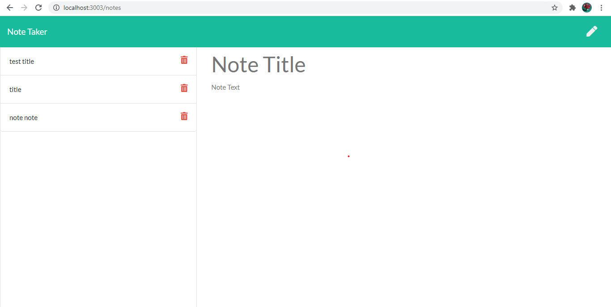

## Project title: Note Taker 

## Description: 

This app allows users to input notes and displays them to the side. 

## Table of Contents

* [Instillation](#installation)
* [Usage](#usage)
* [License](#license)
* [Credits](#credits)

## Installation:

Clone the repo, install NPM, and run "npm start" in the command line. 

# Usage: 

Navigate to local host 3003 to use the site. 

## License: 

None

## Credits: 

Katherine Lynn with starter code from UofA bootcamp

## Github repository: 

[Github repository](https://https://github.com/klynn726/noteTaker)

## Heroku:

[Deployed application](https://stormy-coast-46223.herokuapp.com/ )